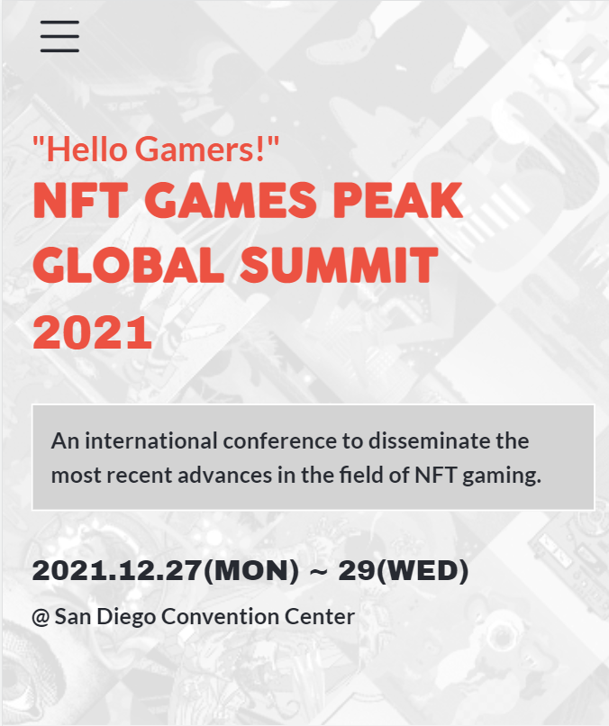
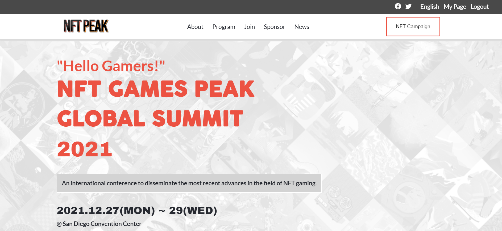

# HTML + CSS + javaScript Capstone

> HTML + CSS + javaScript Capstone. The website is about an NFT Gaming Convention, displaying the activities, the speakers and info about the organizers.

## Preview

## Live Demo

Visit a live version of the website here:
[NFT GAMING PEAK SUMMIT](https://orozcoding.github.io/NFTPeak/)

## Built With

- HTML
- CSS
- javaScript

## Authors

👤 **Author**

- GitHub: [@orozCoding](https://github.com/orozCoding)
- Twitter: [@orozCoding](https://twitter.com/orozCoding)

## 📝 License

This project is [MIT](./MIT.md) licensed.
Original design idea by [Cindy Shin in Behance](https://www.behance.net/adagio07).